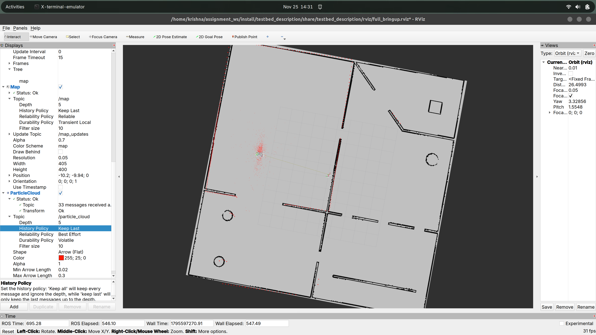

# testbed_navigation

Manual Nav2 bringup for the Testbed-T1.0.0 robot. Instead of using `nav2_bringup`, this package starts each Nav2 piece separately, with its own launch file and parameter file.

| Step | Launch file | Parameters | Status |
|------|-------------|------------|--------|
| Map loading | `launch/map_loader.launch.py` | inline (launch arguments) | Done |
| Localization | `launch/localization.launch.py` | `config/amcl_params.yaml` | Done |
| Navigation | `launch/navigation.launch.py` | `config/nav2_params.yaml` | To do |

---

## How to run
*(filled in as each launch file is finished)*

```bash
cd ~/assignment_ws
colcon build --symlink-install
source install/setup.bash
ros2 launch testbed_bringup testbed_full_bringup.launch.py   # terminal 1: simulation
ros2 launch testbed_navigation map_loader.launch.py         # terminal 2: map
ros2 launch testbed_navigation localization.launch.py       # terminal 3: AMCL
```
Each launch file is one layer, so start them in this order and run each only once (running two copies would start two nodes with the same name).

| Launch file | Arguments (default) |
|---|---|
| `map_loader.launch.py` | `use_sim_time` (`True`), `map` (`testbed_bringup/maps/testbed_world.yaml`) |
| `localization.launch.py` | `use_sim_time` (`True`), `params_file` (`config/amcl_params.yaml`) |

RViz: Fixed Frame `map`; **Map** display on `/map` with Durability **Transient Local**; **ParticleCloud** display on `/particle_cloud` with Reliability **Best Effort**.

---

## Approach

### 1. Make the starter simulation healthy first
Nav2 can only work if the robot, sensors, TF and map are correct, so I fixed the starter code before writing anything new. I ran each part and checked it with ROS tools instead of assuming it worked:
- `colcon build` output and logs
- `ros2 topic hz` / `echo` on `/scan` and `/odom`
- `ros2 param get` for `use_sim_time`
- the Gazebo server log for plugin errors
- the installed `share/` folders compared with the source
- running `map_server` on its own to test the map
- driving with `teleop_twist_keyboard`

I found and fixed **8 bugs**. They are all documented in [`../BUGS.md`](../BUGS.md).

### 2. Refresh the Nav2 concepts
I had used Nav2 about a year ago, so I re-read the [Nav2 concepts docs](https://docs.nav2.org/concepts/index.html) before starting. The key ideas for this package:
- **Nav2 is a set of separate servers.** map_server publishes the map. AMCL finds where the robot is on it. planner_server plans the path. controller_server follows it and sends `/cmd_vel`. behavior_server runs recoveries (spin, back up, wait). bt_navigator decides when to call each one.
- **Lifecycle nodes.** Nav2 nodes go through *unconfigured → inactive → active*. Parameters load in *configure*, but data only flows once the node is *active*. A **lifecycle manager** steps the nodes through these states in order, so for example the map exists before AMCL needs it.
- **TF chain:** `map → odom → base_footprint → lidar_link_1`. The simulation provides everything below `odom`. AMCL adds `map → odom`.

### 3. Package design
- An `ament_cmake` package with only `launch/`, `config/` and `rviz/`. It has no source code, because Nav2's executables already exist. The job is to start them with the right parameters and connect them.
- There is one launch file and one parameter file per step, and each step has its own lifecycle manager, so every step can be started and tested on its own.

### 4. Map loading
`map_loader.launch.py` starts two nodes:
- **map_server**, which reads `testbed_world.yaml` and publishes `/map`
- **lifecycle_manager_map** (`autostart: True`, `node_names: ['map_server']`), which configures and activates map_server

`use_sim_time` and the map path are launch arguments, so a different map can be loaded without editing the file. I did not make a YAML file for map_server: its only two parameters (`yaml_filename`, `use_sim_time`) both come from the launch arguments, so the file would have been empty.

Verified with `ros2 lifecycle get /map_server` → `active [3]`, and in RViz:


### 5. Localization
`localization.launch.py` starts only **amcl** and its own **lifecycle_manager_localization**. It does not start map_server.

**Why separate from map loading:** `nav2_bringup` runs map_server and AMCL in one launch file under one lifecycle manager. I split them because the assignment asks for modular, independent files, and its help notes say to test map loading and localization separately. Now AMCL can be restarted after a parameter change without restarting the map. Start order is still safe: `/map` is Transient Local, so AMCL receives the map even if it starts later.

Key choices in `amcl_params.yaml`:
- `base_frame_id: base_footprint`, to match the frame the diff_drive plugin publishes odometry for (`odom → base_footprint`). The URDF's `base_footprint → base_link` follows REP-105, so nothing needed to change there.
- `DifferentialMotionModel`, because the robot has two driven wheels and casters.
- `laser_min_range: 0.10` / `laser_max_range: 12.0`, copied from the lidar in `testbed.gazebo` (the Humble default is 100 m).
- `likelihood_field` laser model, which is faster and smoother than ray-casting with the `beam` model.
- `do_beamskip: false`: the simulated world matches the map, so there are no unmapped obstacles to skip.
- `set_initial_pose: true` at the spawn pose (0, 5, yaw 0), so AMCL starts localized without a click in RViz.
- I removed parameters that are not used with these choices (`alpha5` for omni robots, `z_short`/`z_max`/`lambda_short` for the beam model, the beam-skip tuning values).

Verified: `ros2 lifecycle get /amcl` → `active [3]`, the TF tree now starts at `map` ([TF tree](docs/tf_frames.pdf)), and in RViz the laser scan lines up with the map walls while the particle cloud follows the robot during teleop:



---

## Challenges

| Challenge | How I solved it |
|-----------|-----------------|
| **Bugs that give no error.** The lidar published at 30 Hz and looked fine, but every reading was `inf`, because its max range was 1.5 m and the nearest wall is about 3.4 m away. | I checked the actual data with `ros2 topic echo /scan`, not just whether the topic existed. I set the range to 12 m. |
| **A ROS 1 plugin left in the URDF.** `libgazebo_ros_control.so` doesn't exist in ROS 2, and it only shows up in the Gazebo log. | I read the Gazebo server log, then removed the plugin, since `diff_drive` already drives the robot. |
| **Wrong clock.** robot_state_publisher used wall time while Gazebo used sim time, which causes TF timing errors in Nav2. | I checked every node with `ros2 param get <node> use_sim_time`. |
| **My own XML mistake.** I wrote `<exec_depend/>` instead of `</exec_depend>` in `package.xml`, and the build failed with `mismatched tag`. | Fixed the tags. I now run `xmllint --noout package.xml` before building. |
| **Wrong parameter names fail silently.** My first launch file used `map` instead of `yaml_filename` and `node_name` instead of `node_names`. ROS 2 just ignores unknown parameters, so there was no error. | Checked the names against the Nav2 docs, then confirmed with `ros2 param get /map_server yaml_filename` and `ros2 lifecycle get /map_server`. |
| **Map not visible in RViz.** `map` was missing from the Fixed Frame list, and the map did not show. | The list only shows TF frames, and `map` only exists in TF once AMCL runs, so I typed it in. The map topic is *Transient Local* (sent once, kept for late subscribers), so the RViz Map display must use the same durability. |
| **`initial_pose` silently ignored.** I first wrote `initial_pose: (0.0, 5.0, 0.0, 0.0)`. YAML reads that as one string, so `initial_pose.x`/`.y` kept their default of 0 and AMCL would have started 5 m away from the real robot, with no error. | Wrote it as a nested block (`initial_pose:` → `x:`, `y:`, `z:`, `yaw:`), which becomes the parameters `initial_pose.x` etc. Checked with `ros2 param get /amcl initial_pose.y` → `5.0`. |
| **Docs for the wrong ROS version.** Some AMCL parameters I found (`random_seed`, `introspection_mode`) come from newer Nav2 releases and do not exist in Humble, so they would be silently ignored. | Compared against Humble's own `nav2_bringup/params/nav2_params.yaml` and now use the Humble version of the Nav2 docs. |
| **Particle cloud not showing in RViz.** The display said "Error subscribing". | AMCL was publishing (`ros2 topic info /particle_cloud -v`), but the display's topic was empty. Set it to `/particle_cloud` with Best Effort reliability, which matches AMCL's publisher. |
